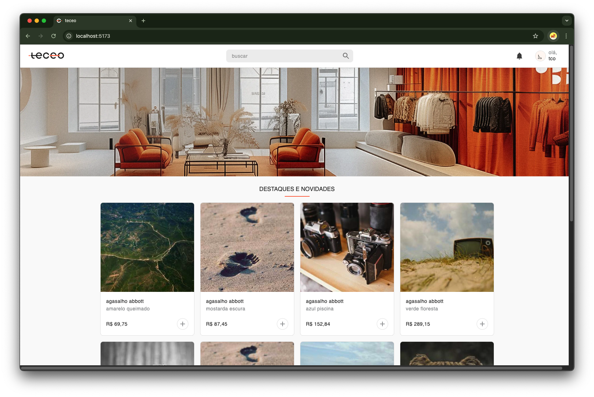
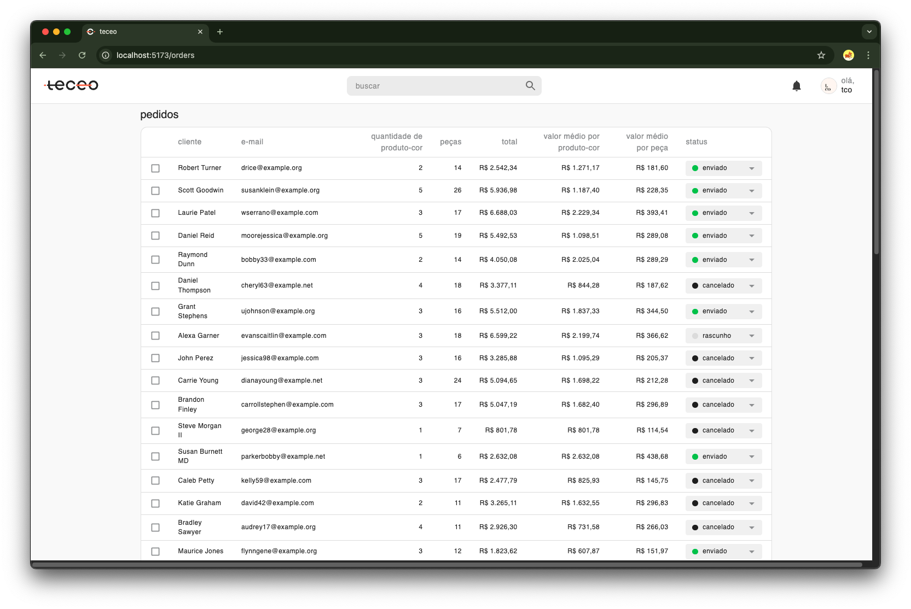

# teceo-challenge

este repositório contém duas aplicações:

1. frontend: Vite + React.js;
2. backend: NestJS + Node.js

---

## pré-requisitos

- [node.js >= 22](https://nodejs.org/);
- [yarn](https://yarnpkg.com/);
- [docker](https://docs.docker.com/);
- [docker compose](https://docs.docker.com/compose/).

---

## configurando o frontend

1. acesse o diretório [`/frontend`](./frontend);
2. para instalar as dependências, execute o comando:
```bash
yarn
```
3. inicie a aplicação executando o comando:
```bash
yarn dev
```

## configurando o banco de dados

a aplicação utiliza um banco do tipo PostgreSQL, e roda em um container docker.

1. dentro do diretório [`/backend/docker`](./backend/docker), suba o container docker executando o comando:
```bash
docker-compose up -d
```
2. baixe o [dump do banco de dados](https://drive.google.com/file/d/1TdEm-pN8Rn5VR1Tgsu_qSv5lbLe7T0tT/view?usp=sharing);
3. após baixar o dump, copie o dump para dentro do docker executando:
```bash
docker cp <file-name>.dump teceo-challenge-postgres:<file-name-inside-postgres>.dump
```
4. para restaurar o dump, execute o comando:
```bash
docker exec teceo-challenge-postgres pg_restore -h localhost -p 5432 -U teceo -d teceo -v <file-name-inside-postgres>.dump
```

## configurando o backend

1. acesse o diretório [`/backend`](./backend).
2. crie um arquivo `.env` na raiz do diretório `/backend` com os mesmos dados do arquivo `.env.example`.
3. para instalar as dependências, execute o comando:
```bash
yarn
```
4. inicie a aplicação executando o comando:
```bash
yarn start:dev
```

## telas da aplicação

1. catálogo de produtos
  * ao entrar na aplicação, é exibido o catálogo de produtos, composto por uma listagem de produtos-cor.
  * a barra de pesquisa genérica permite buscar produtos por nome ou código do produto.
    <details>
      <summary>imagem do catálogo:</summary>
      
    </details>

2. listagem de pedidos
  * ao clicar no ícone do canto superior direito, pode-se acessar a listagem de pedidos.
  * a barra de pesquisa genérica permite buscar pedidos por nome ou cliente do pedido.
  * é possível alterar o status dos pedidos a partir de ações individuais ou em massa.
    <details>
      <summary>imagem da listagem de pedidos:</summary>
      
    </details>

# desafio técnico

## objetivo
  * o objetivo deste desafio é identificar e otimizar pontos de melhoria nas duas principais telas da aplicação — o catálogo de produtos e a listagem de pedidos.
  * ambas as telas apresentam gargalos de performance, tanto no frontend quanto no backend.
  * pode-se utilizar quaisquer técnicas ou ferramentas que considerar adequadas para otimizar o desempenho.

## instruções
1. faça um fork deste repositório.
2. explore o código, identifique os problemas e implemente as melhorias que considerar necessárias.
3. adicione um arquivo `CHANGES.md` na raiz do repositório, documentando as mudanças feitas e as estratégias utilizadas para melhorar a performance. fique à vontade para adicionar qualquer informação ou explicação que entender relevante.
4. suba um repositório público em alguma plataforma de hospedagem Git com as melhorias feitas.
5. envie o link do repositório para o e-mail de contato que você recebeu este desafio técnico.

## critérios de avaliação
  * clareza e organização do código.
  * qualidade das soluções implementadas.
  * criatividade e fundamentação técnica nas melhorias aplicadas.
  * documentação clara e detalhada das mudanças realizadas.

sinta-se à vontade para ir além do esperado — soluções criativas e bem fundamentadas são sempre bem-vindas!

boa sorte!